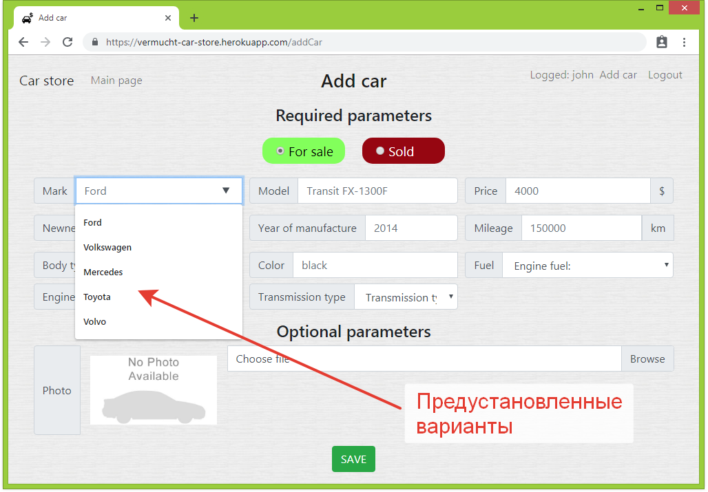
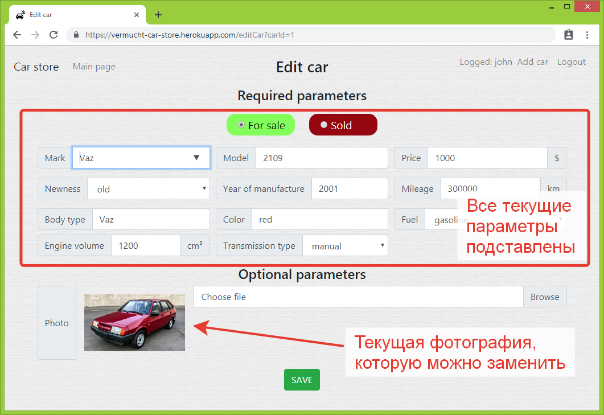

# Площадка продажи машин

## Техзадание

Реализовать площадку объявлений для продажи машин

1. Основная страница: таблица со всеми объявлениям машин на продажу. Кнопка "новое объявление" на основной странице.

1. Объявление имеет статус: продано или нет.

1. Машины имеют параметры: марка. тип кузова и т.д.

1. Страница добавления машин.

1. Возможность загрузить фотографию машины.

1. Должны существовать пользователи, логин. Только тот, кто подал заявление, может его менять.

## Где посмотреть?

1. Приложение развернуто на платформе heroku: https://vermucht-car-store.herokuapp.com/

1. Heroku периодически очищает базы данных, поэтому, возможно, база окажется пустой. 

1. В таком случае можно создать своего пользователя и разместить свое объявление.

## Что использовано?

**Кратко:** 

PostgreSQL, JDBC, Hibernate, Liquibase, Servlet, Filter, JSP, HTML, CSS, Javascript, JQuery, JSON. 

**Подробнее:**

1. Хранение данных - в базе **PostgreSQL**, создаваемой при сборке приложения с помощью **Liquibase**. 
   Для связи объектов с базой данных использована библиотека **Hibernate**.

1. Серверная логика реализована с помощью **javax.servlet**. 

   Фильтры проверяют, залогинен ли пользователь и может ли он редактировать машину, 
   создают Hibernate session для текущего запроса.
   
   Сервлеты отвечают за создание/редактирование объектов пользователей и машин, 
   перенаправление на страницы и т.д. 
   
   Инициализация объектов производится в слушателе контекста при инициализации приложения. 
   Далее объекты передаются как параметры контекста.
   
1. На Frontend применена смесь:
   
   Статические элементы страницы (например, список вариантов в форме редактирования)
   генерируются на сервере с помощью **JSP**. Свойства элементов задают атрибуты **HTML** и **CSS**.
   
   Динамические элементы, появляющиеся с помощью **AJAX**-запросов без перезагрузки страницы,
   обрабатываются с помощью **Javascript** и **Jquery**.
   
   Обмен данных между сервером и клиентом идет через **JSON**-объекты (FrontItem), описанные и на
   серверной, и на клиенской стороне. Для преобразования объекта в JSON-строку и наоборот на сервере
   используется библиотека **Google GSON**. 
   
## Подробное описание

### Главная страница

1. На главной странице размещены все имеющиеся в базе данных объявления. 

    
    
1. Фильтры позволяют показать только определенные объявления:
   созданные сегодня, с фотографиями или машин определенной марки.
   
   Реализованы фильтры с помощью AJAX-запросов методом GET с параметрами. 
   
   
   
1. Кнопки действий в правом верхнем углу позволяют войти в систему или создать нового пользователя.

1. Также, просто ради демонстрации, не вошедшему в систему пользователю доступна кнопка "Add Car" - создать машину.
 
   Если нажать на нее, не войдя в систему, получим ошибку - приглашение.
   
   
   
1. Все страницы созданы с использованием "резиновой верстки" Bootstrap GRID и меняют свой 
   вид при изменении размера экрана.    
   
   
   
### Регистрация и вход

1. Страницы регистрации и входа выполнены максимально просто. 
   Пользователь вводит свои данные и проходит дальше.

1. На странице регистрации действует валидация вводимых данных с помощью HTML5
   регулярных выражений: должны быть только латинские буквы и цифры.
   
   
   
1. На странице входа в систему пользователь вводит логин и пароль.

   Если логин и пароль не найдены в базе данных - выдается ошибка.
   
   
   
   Если найдены - пользователь перенаправляется на главную страницу с сообщением об успехе.
   
     
    
### Добавление объявления

1. Находясь в системе, пользователь может добавить машину с помощью кнопки "Add car".

1. Страница добавления машины содержит обязательные параметры и опциональные (фото).

     

1. Некоторые параметры (например, марка машины, ), имеют предустановленные варианты.
   Пользователь может выбрать один из них, а может вписать свой.
   
   Варианты задаются администратором в файле настройки приложения.
   
1. Вводимые параметры проходят валидацию и на странице (с помощью атрибутов HTML), 
   и на сервере (с помощью регулярных выражений и сравнения с заданными интервалами цифр).
   
    
   
### Редактирование объявления

1. Для редактирования объявления пользователь нажимает на ссылку "Edit car".

     

1. Ссылка "Edit car" специально отображена на всех машинах для демонстрации проверки на стороне сервера. 
   
1. Сервер через базу данных проверяет, что текущий пользователь является создателем этого объявления. 
   Если пользователь пытается изменить объявление, созданное не им, выдается ошибка.
   
     
   
1. Если проверка на сервере прошла успешно, и пользователь является владельцем машины - 
   то открывается окно редактирования.
   
1. При этом текущие параметры машины подставляются в формы. 
   В том числе отображается и текущая фотография машины.
   
   

1. Идентификатор редактируемой машины передается с помощью скрытого поля в форме редактирования. 
Поэтому для безопасности сервер еще раз проверяет при получении запроса - является ли пользователь владельцем сохраняемой машины.
Если нет - выкидывается исключение, и машина не сохраняется.